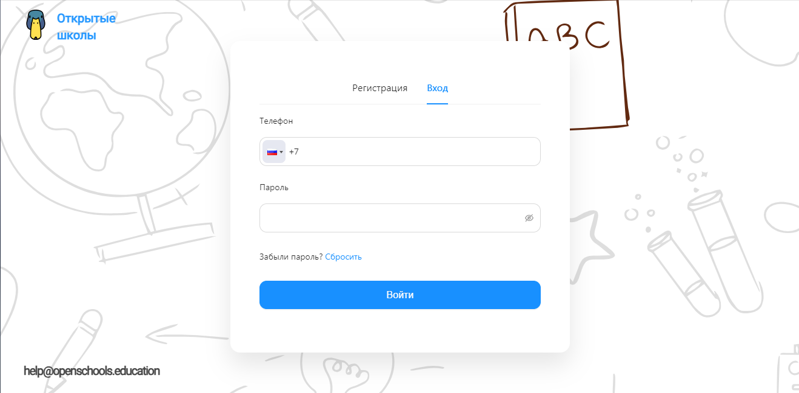

# Open schools

Open Source schools platform.



## Getting started

> **Node should be > 16.** You can check node version using `node -v` command in your terminal.

```bash
# 1) Clone the repo
git clone git@github.com:LamArt/open-schools-platform-frontend.git
cd open-schools-platform-frontend

# 2) Install dependencies
yarn install

# 3) Go to the open-schools directory
cd .\apps\schools\

# 4) Install dependencies for app
yarn install

# 5) create base .env file
.env

# 6) launch app
yarn dev
```

Now open your browser and head to http://localhost:3000 - you should see open schools app

## Developing

Check [developing.md](docs/develop.md)

## Deploying

Check [deploy.md](docs/deploy.md)
